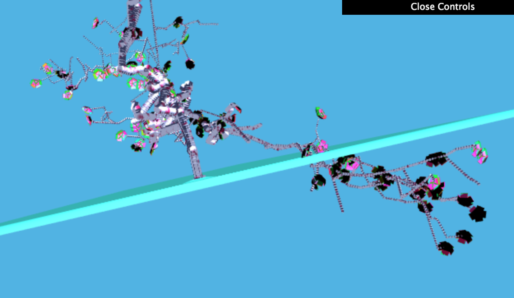

# Homework 4: L-systems

## L-System Components
The way you implement your L-System is ultimately up to you, but we recommend
creating the following classes / constructs to help you instantiate, expand, and
draw your grammars:
* Some sort of expandable collection of string characters. You might implement
a linked list data structure, or you might use a basic Javascript array (which
is resizeable).
* Some sort of class to represent a Rule for expanding a character into a
string. You might consider creating a map within each Rule that maps
probabilities to strings, so that a Rule can represent multiple possible
expansions for a character with different probabilities.
* A second Rule-style class that dictates what drawing operation should be
performed when a character is parsed during the drawing process. This should
also be a map of probabilities, but this time the values in the map will be
functions rather than strings. Invoke a given function, e.g. `drawBranch`, when
a character is parsed.
* A Turtle class that lets you keep track of, at minimum, a position, an
orientation, and a depth. You should also create a stack onto which you can push
and pop turtle states.
* A class in which to store the VBOs that will represent __all__ of your faceted
geometry. __Do not draw individual mesh components one at a time. This will
cause your program to render very slowly.__ Instead, expand lists of vertex
information as you "draw" your grammar, and push all VBO data to the GPU at once
after you've finished parsing your entire string for drawing.

## OBJ loading
So that you can more easily generate interesting-looking plants, we ask that you
enable your program to import OBJ files and store their information in VBOs. You
can either implement your own OBJ parser, or use an OBJ-loading package via NPM:

[obj-mtl-loader](https://www.npmjs.com/package/obj-mtl-loader)

[webgl-obj-loader](https://www.npmjs.com/package/webgl-obj-loader)

## WRITE UP

[]

## Aesthetic REQ
* Grows in 3D
*  Best is at 4th iteration
* Used webgl-obj-loader and uploaded my own 3d models
* Randomization of angles for branching and crookedness in branches
* Flowers/polyps are added

## Interactivity
    *The Axiom is changeable by adjusting the height
    *The color of the coral is changeable by color selection
    *You can change the number of iterations of the grammer
    
